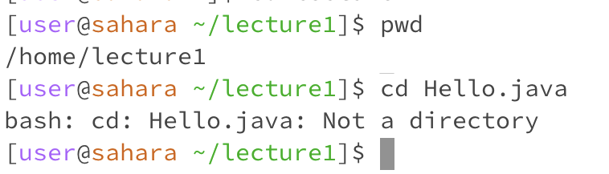

# Lab Report 1

## cd 
1. Share an example of using the command with no arguments.
   
   
* The working directory when `cd` was run was `/home`.
* We got an output of nothing because the command did not do anything. `cd` means change directories but because we did not give the `cd` command an argument (there was nothing typed after `cd`), we did not give it a directory to change to. Therefore, the label of the terminal prompt stayed the same and we remained in the /home directory.  
* The output is not an error because we did not give the `cd` command a directory to change to, so it correctly remained in the /home directory.  
2. Share an example of using the command with a path to a directory as an argument.
  
* The working directory when `cd` was run was `/home`.
* We got an output of nothing but the label on the terminal prompt changed to `[user@sahara ~/lecture1]`. `cd` means change directories and because we gave the `cd` command an argument of `lecture1` (a folder that exists/is visible in the home directory), we successfully moved into the lecture1 directory. 
* This is not an error because the `lecture1` directory exists in the home directory and after being passed in as an argument to `cd`, we successfully switched to the `lecture1` directory.
3. Share an example of using the command with a path to a file as an argument.
  
* The working directory when `cd` was run was `/lecture1`.
* We got the output `bash: cd: Hello.java: Not a directory` because we passed in a file, in this case Hello.java, as an argument to `cd` requires a directory as an argument. Because we cannot move into a file, the label on the terminal prompt stays the same and so does the working directory. 
* This is an error because cd means change directory and requires a directory as an argument, not a file like Hello.java because we cannot move into a file, the system prints out an error message in the terminal  

## ls 
1. Share an example of using the command with no arguments.

* The working directory when `ls` was run was `/home`.
* We got the output `hello.txt  lecture1` because when `ls` is called without any arguments after it, it lists the folders and files in the initial working repository. Since hello.txt and the lecture1 repository are both in the home directory, their names are printed out in the terminal.
* This is not an error because when there is no argument after `ls`, the files and repositories in the working directory are printed if no other directories are specified as an argument. 
2. Share an example of using the command with a path to a directory as an argument.
  
* The working directory when `ls` was run was `/home`.
* The output `Hello.java  Hey.txt  messages  README` was printed because a directory is passed in as an argument after `ls`, the files in that directory are printed in the terminal. Because `lecture1` was passed in as the argument and Hello.java, Hey.txt, messages, and README are files/directories in `lecture1`, they are printed in the terminal. 
* This output is not an error because the files and directories that were in `lecture1` passed in as an argument were printed out correctly after `ls` was called. 
3. Share an example of using the command with a path to a file as an argument.
  
* The working directory when `ls` was run was `/home`.
* The output when `ls hello.txt` is run is hello.txt because hello.txt is accessible in the /home directory but because it is just a file and doesn’t contain anything but itself, its name `hello.txt` is printed in the terminal. 
* This output is not an error because `hello.txt` is accessible in the /home directory but it is not a folder, so rather than its contents being printed, the title of the file `hello.txt` is printed.   

## cat
1. Share an example of using the command with no arguments.
   
* The working directory when `cat` was run was `/home`.
* I got an argument of nothing but the cursor was acting very strange and would not show the terminal prompt or label again. This is because `cat` is supposed to read a file that is passed in as input and print out its contents, but because we did not give it any argument, it doesn't have anything to read, thus creating a strange error.
* This output is an error because `cat` is supposed to read a file that is passed in as an argument, but since we ran `cat` without any arguments, it creates a strange error. 
2. Share an example of using the command with a path to a directory as an argument.
  
* The working directory the command was run was `/home`.
* We got an message printed in the terminal that `cat: lecture1: Is a directory` because cat reads from a file and prints the contents of that file, not a directory. Because of this, when we pass a directory as an argument, we get an error and it doesn’t print out the contents of the directory. 
* The output is an error because `cat` reads from files not directories and `lecture1` that was passed in is a directory not a file, so it can’t be read by `cat`.
3. Share an example of using the command with a path to a file as an argument.

* The working directory the command was run was `/home`.
* The output is the content of the hello.txt file that was passed in as an argument to `cat`, which in this case is just the line “hi”. “hi” was then printed in the terminal as expected. 
* This is not an error because `cat` reads from files, and it was passed a file that existed within /home that it could read, so it printed the contents of that file. 

