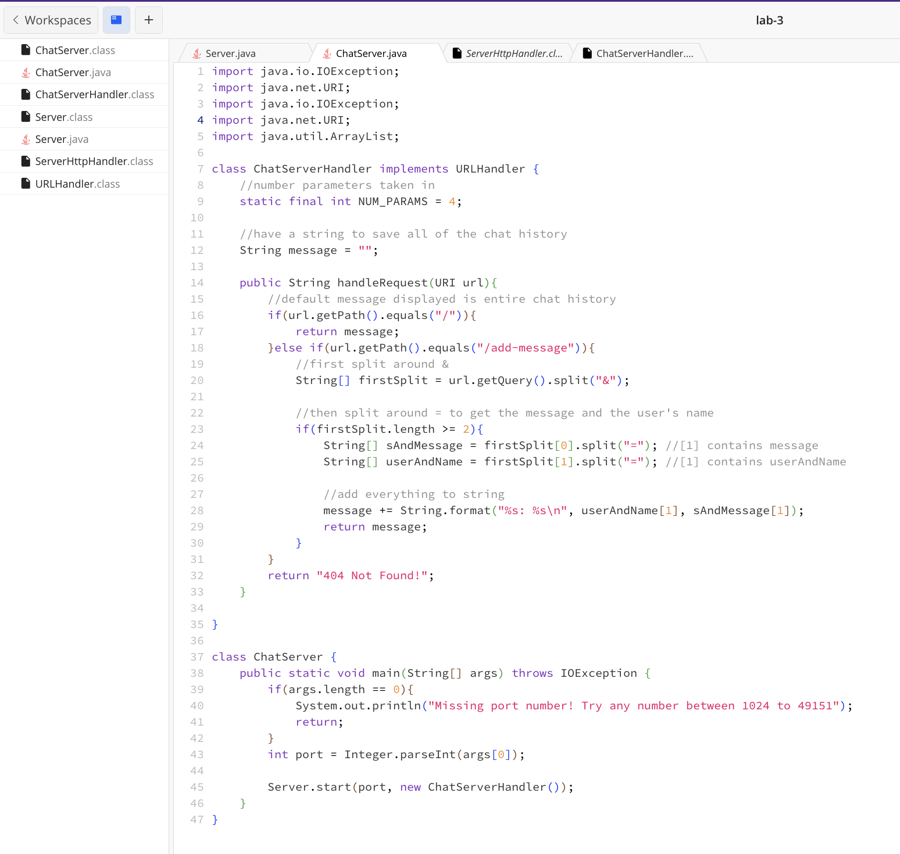
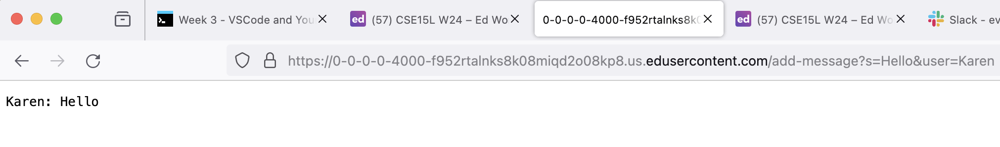
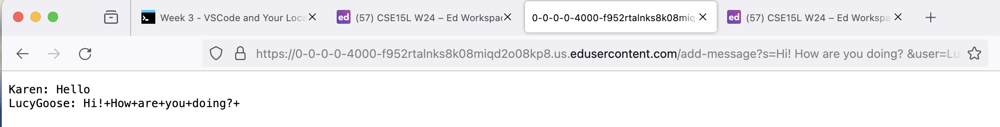
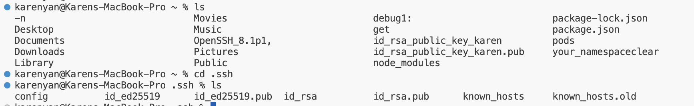
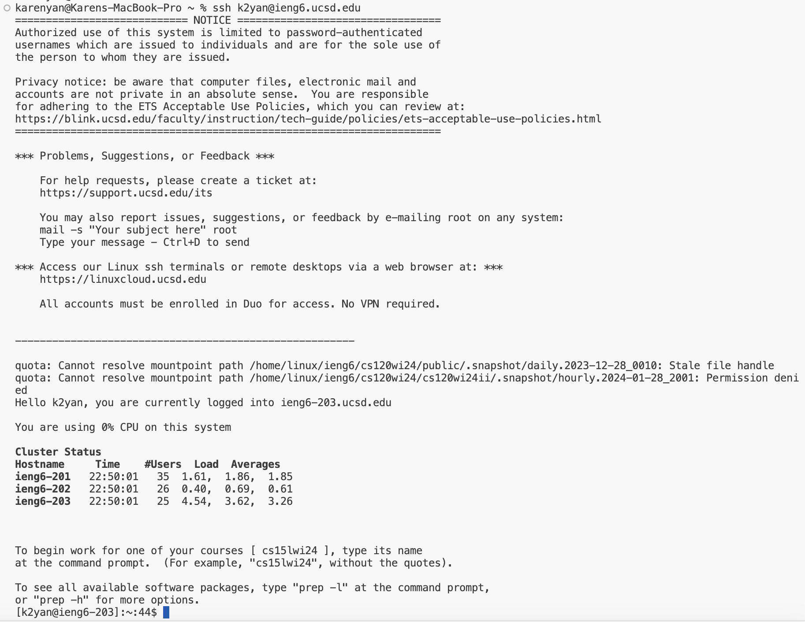

# Lab Report 2 - Week 3

## Part 1
1. **Code for `ChatServer`**
   
   
2. **First usage of `/add-message`**
   
   * The method in my code that was called was the `handleRequest` method that takes in a
     URI reference and checks the path of the URI. Because the path in this case was equal
     to `/add-message`, it split the query around the ‘&’ sign to isolate the message and
     the username which are then added to the message string.
   * The argument to this method is the URI reference (`url`) of the web server. The relevant
     fields of this class are the String `message` and the String arrays `firstSplit`,
     `sAndMessage`, and `userName`. The `message` String initially starts empty before the
     first method call and the arrays `firstSplit`, `sAndMessage`, and `userAndName` are not
     declared before the `handleRequest` method is called, so their initial value is null.
   * The values of the `message` String and the arrays `firstSplit`, `sAndMessage`, and
     `userAndName` all change. The value of `message` changes from an empty String, “”,
     to “Karen: Hello\n” and the value of `firstSplit` becomes `[“s=Hello”, “user=Karen”]`.
     The value of `sAndMessage` becomes `[“s”, “Hello”]` and the value of `userAndName`
     becomes `[“user”, “Karen”]`.   
     
3. **Second usage of `/add-message`**
   
   * The method in my code that was called was the `handleRequest` method that takes in a
     URI reference and checks the path of the URI. Because the path in this case was equal
     to `/add-message`, it split the query around the ‘&’ sign to isolate the message and
     the username which are then added to the message string.
   * The argument to this method is the url of the web server. The relevant fields of this
     class are the String message and the String arrays `firstSplit`, `sAndMessage`, and `userName`.
     The `message` String before the second message is added is “Karen: Hello\n” and the values
     in the array `firstSplit` are [`“s=Hello”, “user=Karen”]`. The values of `sAndMessage` are
     `[“s”, “Hello”]` and the values of `userAndName` are `[“user”, “Karen”]`.
   * The values of the message String and the arrays `firstSplit`, `sAndMessage`, and `userAndName` 
     are all changed. The value of `message` is updated from “Karen: Hello\n” to
     “Karen: Hello\nLucyGoose: Hi!+How+are+you+doing?+\n”. The value of `firstSplit` becomes
     `[“s=Hi!+How+are+you+doing?+”, “user=LucyGoose”]`. The value of `sAndMessage` becomes
     `[“s”, “Hi!+How+are+you+doing?+”]` and the value of `userAndName` becomes `[“user”, “LucyGoose”]`.
     The argument URI `url` that is passed in also has changed its query to
     `/add-message?s=Hi!+How+are+you+doing?+&user=LucyGoose`.
      
      

## Part 2
1. **The absolute path to the private key for your SSH key for logging into `ieng6`**   
   The absolute path to the private key for my SSH key for logging into ieng6 is Users/karenyan/.ssh/id_ed25519. 

2. **The absolute path to the public key for your SSH key for logging into `ieng6`**   
The absolute path to the public key for my SSH key for logging into ieng6 is Users/karenyan/.ssh/id_ed25519.pub.
   
   
3. **Terminal interaction where you log into your ieng6 account without being asked for a password.**

    
   
## Part 3
Something that I learned in the lab from week 2 that I did not know before was the existence of servers, especially remote servers and how servers could be launched and accessed remotely. To begin, I learned that servers have ports that they run on that’s part of their URL and they can be chosen by the programmer. I also learned how to sign into remote servers, in this case ieng6, and I could access the different machines in B260, just by changing the port number (i.e. 4017 for computer 17 in B260). FInally, I learned that I can load the web page I launched on that computer from any other computer that is in the lab, which was very interesting!

   
