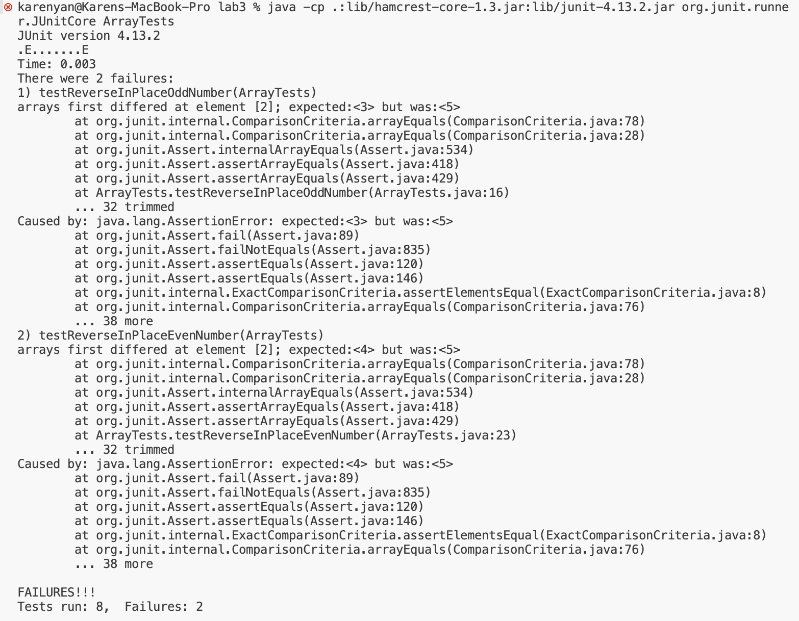

# Lab Report 3
## Part 1 - Bugs
* The bug that I chose is the one in the `reverseInPlace` method.
1. A failure inducing input for the buggy program is the integer array {3, 4, 5}. <br>
Example of JUnit test for {3, 4, 5}: 
```
@Test
 public void testReverseInPlaceOddNumber() {
   int[] input1 = {3 , 4, 5};
   ArrayExamples.reverseInPlace(input1);
   assertArrayEquals(new int[]{5, 4, 3}, input1);
 }
```
2. An input that doesn’t induce a failure is an array of just on element {3}. <br>
Example of JUnit test for {3}: 
```
@Test
 public void testReverseInPlace() {
   int[] input1 = {3};
   ArrayExamples.reverseInPlace(input1);
   assertArrayEquals(new int[]{3}, input1);
 }
```

3. The symptom, as the output of running the tests, is that the failure inducing input's test does not pass, while the array with just one element's test does pass.
   

4. The bug, as the before-and-after code change required to fix it
   * Bug from before:
     ```
      static void reverseInPlace(int[] arr) {
         for(int i = 0; i < arr.length; i += 1) {
           arr[i] = arr[arr.length - i - 1];
         }
       }
     ```
   * Code after bug was fixed:
     ```
     static void reverseInPlace(int[] arr) {
       for(int i = 0; i < arr.length / 2; i += 1) {
         //save previous value
         int prevVal = arr[i];
         arr[i] = arr[arr.length - i - 1];
         //switch the two values
         arr[arr.length - i - 1] = prevVal;
       }
     }
     ```
    
* This fix solves the problem of the bug because before, when the method tried to reverse the array, it was changing the values at the previous indices to the values at the later indices. However, the previous values were never stored, so when the method tried copying the values in the previous half (less than arr.length / 2) of the array to the indices in the second half of the array, it was just copying the new values (i.e. the values of the second half of the array). This resulted in the values in the second half of the array being copied twice in the original array. The solution fixes this by only traversing through the front half of the array, then storing the value in the earlier index before assigning it to the value in the larger index. However, because the value in the previous array is stored, it is successfully copied into the later index, and the array is reversed successfully. 

## Part 2 - Researching Commands 
Chosen command: `grep`

4 command line options 
1. Option: `-n`
   * Example 1:
       * command + OUPUT :
         ```
         $grep -n "chapter" find-results.txt
         1386:technical//911report/chapter-13.4.txt
         1387:technical//911report/chapter-13.5.txt
         1388:technical//911report/chapter-13.1.txt
         1389:technical//911report/chapter-13.2.txt
         1390:technical//911report/chapter-13.3.txt
         1391:technical//911report/chapter-3.txt
         1392:technical//911report/chapter-2.txt
         1393:technical//911report/chapter-1.txt
         1394:technical//911report/chapter-5.txt
         1395:technical//911report/chapter-6.txt
         1396:technical//911report/chapter-7.txt
         1397:technical//911report/chapter-9.txt
         1398:technical//911report/chapter-8.txt
         1400:technical//911report/chapter-12.txt
         1401:technical//911report/chapter-10.txt
         1402:technical//911report/chapter-11.txt
         ```
         * This command is counting all of the repositories and files with “chapter” in
           their name and also provides the line number for each of the names of the files or 
           repositories that contain the chapter keyword.
         * This is useful in the case where you are going through a large list of files
           or trying to locate one file, and it would give you the line number to find
           the file at.
    * Example 2:
       * command + output:
         ```
         $grep -n "bio" technical/biomed/1471-2105-3-2.txt

         11:    	theory on the origin and evolution of biological species [
         366:     biologically-active structure (see CRW Methods
         ```
      * In this case, the grep command is looking for the lines and line numbers
        of the file `technical/biomed/1471-2105-3-2.txt` that contain the word “bio”
        in them.
      * This is useful in the case where you are going through a very long file and
        trying to locate a specific line or topic, but you do not want to look through
        the entire document. Grep would give you the line numbers of the matches, and
        from there, you could look through a shorter list of lines to find the line you 
        are looking for, and you can go to that line in the file to find the rest of the 
        desired information.
   * Citation: I used the website https://www.geeksforgeeks.org/grep-command-in-unixlinux/
        in order to find different command line options for grep, but I came up with the
        examples myself. 
2. Option: `-v`
   * Example 1: 
     * Command + ouptput:
       ```
       $grep -v ".txt" find-results.txt
       
       technical/
       technical//government
       technical//government/About_LSC
       technical//government/Env_Prot_Agen
       technical//government/Alcohol_Problems
       technical//government/Gen_Account_Office
       technical//government/Post_Rate_Comm
       technical//government/Media
       technical//plos
       technical//biomed
       technical//911report
       ```
    * This is searching for all of the files in find-results.txt that do not
      contain .txt in their name.
    * This is useful if you want to get a list of files that do not contain a
      certain keyword or want to get all files except from a certain directory
      or of a certain type, and this will allow you to do so quickly.
      
   * Example 2:
      * Command + ouptput:
        ```
        $grep -v "this" technical/plos/pmed.0020191.txt
        
        The excellent article by Jordan Paradise, Lori B. Andrews, and colleagues, “Ethics.
       	Constructing Ethical Guidelines for Biohistory” [1], neither advocates nor argues against
       	biohistorical research; instead, it points out that such investigations are currently
       	taking place without guidelines—ethical, scientific, moral, or religious. The question
       	remains: if such guidelines were to be established, what individuals, institutions,
       	governments, medical examiners, family members, or intrepid biographers are to be given
       	permission? Who is to decide what is “historically significant”? Not to mention the
       	meta-question: who is to decide who is to decide? I apologize to the authors if my brief
        ```
      * This command and option is searching for all of the lines in
        `technical//biomed/1468-6708-3-1.txt` that do not contain the word “this”.
      * This could be helpful when you’re trying to narrow down information in a
        file and you know which information you are certain you want to filter out
        all lines that contain that topic out.  This could also be helpful if you
        want to discard all information that contains a certain keyword and store
        the rest elsewhere. 
    * Citation: I used the website https://www.geeksforgeeks.org/grep-command-in-unixlinux/
       in order to find different command line options for grep, but I came up with the
       examples myself.

 3. Option: `-A n`
    * Example 1:
       * command + ouput:
         ```
         $grep -A 4 "EVGFP" technical//biomed/1468-6708-3-1.txt
         
         good, fair, or poor?) (EVGFP) which was collected every 6
         months. EVGFP is a simple but well-known measure, which
         has been studied in detail [ 15 16 ] , and is predictive
         of health events in many studies [ 17 ] . Because we are
         examining health status over time, we added a sixth
         health state, dead. Data were available about 93% of the
         --
               	value to each level of EVGFP [ 19 ] . Preliminary results
               	were similar for the two approaches, however, and we
               	report results using only the simpler definition.
               	The calculations had to be modified to include the 438
               	persons in the second African American cohort, who have
         --
             	thus substantial change in EVGFP over time, in both
             	directions. Table 1shows the mean YOL and YHL (calculated
             	from EVGFP) in the first seven years of the study, adjusted
             	to age 73. For example, black women averaged 6.3 YOL, but
             	only 4.2 YHL of a maximum possible 7. We calculated some
             	additional descriptive statistics, shown in the final two
             	lines: years of unhealthy life (YOL minus YHL) and years
         --
               	EVGFP, on which YHL was based, might have missed some
               	effects of obesity on risk factors for future health. A
               	person who is depressed because of a poor self-image
               	related to obesity or who has osteo-arthritis related to
               	obesity and limits to activities to successfully avoid
               	pain would surely have worse EVGFP than others, based on
               	results from many studies. However, health measures
               	designed specifically to measure those conditions might
               	be more sensitive to change in weight than EVGFP. If YHL
               	were based on such measures, the superiority of YHL to
               	YOL would likely be even greater than that shown here.
               	These more sensitive measures might also have detected
               	differences between the overweight and normal weight
         --
               	of any differences in EVGFP.


             	Conclusion
         --
             	EVGFP Is your health excellent, very good, good, fair or
             	poor?
             	QALY Quality-adjusted life years
             	YHL Years of healthy life
             	YOL Years of life
    
       * This command finds the keyword and prints out the first n lines after the
         keyword is found. In this case, it is finding lines with the keyword “EVGFP”
         and printing the first 4 lines after the word.
       * This is useful if you would like to create a website or something that searches
         for a keyword and then prints out some context, so you could easily locate which
         part of the file you need to go to in order to get the information that you want.
    * Example 2:
      * output + command:
         ```
         $grep -A 2 "model" technical/biomed//gb-2002-3-9-research0048.txt
         6, 7] and general linear modeling such as ANOVA [ 8, 9]
         provide offsets, scaling factors and other parameters,
         but again assume linear relationships and properties of

         --
         observed distributions did not fit a theoretical model
         and contained well determined, systematic features. In
         this work we seek only to make the distributions similar
         --
         [ 1] reduced model for the oligonucleotide array data.
         Unfortunately, the set of genes believed to be
         differentially regulated due to HIV infection was found
         ```
      * This option finds the keyword and prints out the first n lines after the
        keyword is found. In this case, it is finding lines with the keyword “model”
        and printing the first 2 lines after the location of the word.
      *  This is useful if you would like to create an application that matches a
      search for a keyword and then prints out some context, so you could easily
      locate which part of the application you need to go to in order to get the
         information that you want.
4. Option: `-f`
   * Example 1:
      * Command and output:
        ```
        $grep -f pattern-file.txt find-results.txt

        technical//plos/pmed.0010010.txt
        technical//plos/pmed.0010013.txt
        technical//plos/pmed.0020048.txt
        technical//plos/journal.pbio.0020040.txt
        technical//plos/journal.pbio.0020043.txt
        technical//plos/journal.pbio.0020042.txt
        technical//plos/journal.pbio.0020046.txt
        technical//plos/journal.pbio.0020047.txt
        technical//plos/pmed.0020045.txt
        technical//plos/pmed.0020047.txt
        technical//plos/pmed.0020040.txt 
        ```
         * pattern-file.txt contents:
           ```
           2004
           1001
           ```
       * This command finds the files that match the patterns from the file
         provided as an argument.
       * This is useful in order to quickly find many different patterns without
         having to retype commands into the terminal. Additionally, it could be used
         in a bash script where a file of patterns is provided and then the grep command
         can quickly search for those patterns. It also makes editing the patterns that
         you want to search for much easier.

   * Example 2:
      * Command + output:
        ```
        $grep -f pattern-file.txt technical//government/Env_Prot_Agen/ctf1-6.txt
        concentration which will permit normal propagation of fish and
        An early published account of a full life-cycle, fish
        life-cycle tests using other toxicants and fish species.
        life-cycle toxicity tests with the early life-stages (ELS) of fish
        life-stages of fish to toxicants provides estimates of chronically
        concentration for fish, and that the most sensitive life stages are
        days post-hatch for warm water fish with embryogenic periods
        fish with longer embryogenic periods. They concluded that in the
        Because of the high cost of full life-cycle fish toxicity
        In a review of the literature on 173 fish full life-cycle
        life-cycle toxicity tests for fish without compromising their
        embryo-larval survival and teratogenicity test for fish and other
        effort, compared to the fish full life-cycle chronic and 28-day ELS
        operated to prevent recirculation or leakage of air from chemical
        capricornutum. The fish and invertebrates should appear healthy,
        testing fish and invertebrates is an important factor in the
        discussed the relationship between sample size (number of fish) and
        the standard error of the test, and considered 20 fish per
        very narrow control limits may be unfairly penalized if a test
        vapors. Oil-free air pumps should be used where possible.
        Particulates can be removed from the air using BALSTON® Grade BX or
        that return air from chemistry laboratories and/or sample holding
        test rooms, or that air from toxicity test rooms does not
        result in a net flow of potentially contaminated air to sensitive
        Flake fish food -- TETRAMIN® and BIORIL® are available
        importation of non-native fishes or the use of recommended test
        larval fish, is required for all tests. In a given test, all
        transferring smaller organisms such as larval fish.
        Holding tanks for fish are supplied with good quality
        uncommon for some fish mortality (5-10%) to occur during the first
        replacing the air above the water in the bags with oxygen from a
        airstone supplied by a portable pump. The DO concentration must not
        ```
     * This command finds the lines in the file
       technical//government/Env_Prot_Agen/ctf1-6.txt that contain the word pollution,
       air or fish from the pattern-file.txt as an argument.

     *  This is useful if you would like to create an application that matches a
        search for a keyword and then prints out some context, so you could easily
        locate which part of the application you need to go to in order to get the
        information that you want.  This also makes it easy to edit the different
        patterns that you want to search for. 
   * Citation: I used the website https://www.geeksforgeeks.org/grep-command-in-unixlinux/
     in order to find different command line options for grep, but I came up with the
     examples myself.


 


 


