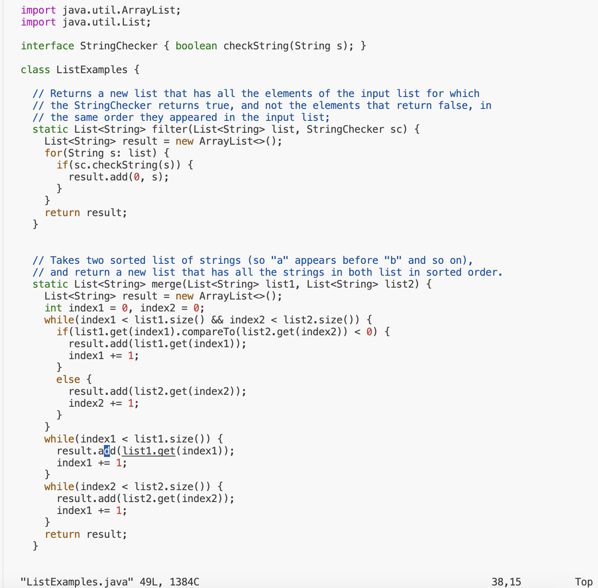

# Lab Report 4

## Step 4:
* **Keys pressed**: s, s, h, `<space>`, k, 2, y, a, n, @, i, e, n, g, 6, -, 2, 0, 1, ., u, c ,s, d, ., e,
  d, u `<enter>`
* Screenshot: 
* The ssh keyword followed by my account name allows me to log into the remote server without having to enter my password
  because I have connected the SSH key from my computer to the remote server.

## Step 5: 
1. **Keys pressed:** c, s, 1, `<tab>`, `<enter>`
* Screenshot: 
* This is because I wanted to do work for CSE 15L, so I moved to the inside of that directory.
  By using the `<tab>` button, I was able to autofill the rest of the directory without typing
  anything myself. 

2. **Keys pressed:** g, i, t, `<space>`, c, l, o, n, e, `<command>` `<v>`, `<enter>`
* Screenshot: 
* In order to clone the repository using my ssh key, I typed in the git clone c
  ommand then used the `Command-V` command in order to paste the password-protected
  SSH key into the terminal without making any spelling mistakes.

## Step 6:
1. **Keys pressed:** l, s, `<enter>`
 * Screenshot:
 * 
 * In order to find the name of the lab's directory, I used `ls` to list out all of the
   files/directories in the `cs15lwi24` directory. 

2. **Keys pressed:** c, d, `<space>`, l `<tab>`, `<enter>`
* Screenshot: 
* After checking the names of the directories in `cs15lwi24`, I then had to move into the directory for lab7 in order to run the tests inside
  of it. I typed `cd`, then `l` and tab to autofill the rest of the directory name `lab7`,
  so that I didn’t have to type it out myself.  

3. **Keys pressed:** `<up>` `<up>` `<enter>`
* Screenshot: 
* Once I was inside the lab7 directory, I needed to know where the test files were
  located, so I used the up arrow twice in order to access the `ls` command I had
  run that was now stored in the search history. I then ran it to find the name of
  the tester files, which was `test.sh`.

4. **Keys pressed:** b, a, s, h, `<space>`, t, `<tab>`, `<enter>`
* Screenshot: 
* In order to run the tests without typing out the whole command myslef, I could run the
  bash script inside of test.sh.
  I needed to use the `bash` command to run the test.sh file, so I typed bash and
  then t, which is the first letter of the `test.sh` file. Then I used `tab` to
  autofill the name of the file before running the command. 

## Step 7
1. **Keys pressed:** v, i, m, `<space>`, L, i, `<tab>`, ., `<tab>` `<enter>`
   * Screenshot: 
   * In order to edit the code in the `ListExamples.java` file, I had to open the file in vim, so
     I typed the vim command and the first two letters of the `ListExamples.java` file, before
     using `<tab>` to autofill the rest of the name. However, it stopepd after `ListExamples`,
     so I typed `.` and then tab again to fill in the rest of the `.java` tag before running 
     the command. 
2. **Keys pressed:**:`<down>` `<down>` `<down>` `<down>` `<down>` `<left>` `<left>`
* Screenshot:  
* In order to get to the incorrect line in the ListExamples.java file, I had to navigate down a
few lines in the code, until I reached that line, and then moved left through the line until I
was one space to the right of the word index1 in the third while loop.
3. **Keys pressed:** `i`
* Screenshot: 
* I used the key `i` in order to enter insert mode in vim so I could edit the code in the
  ListExamples.java file. After I pressed this key, the word `INSERT` appeared at the bottom of
  the terminal window, and I can now directly edit the ListExamples.java file. 
4.**Keys pressed:** `<delete>` `2`
* Screenshot: 
* After I had navigated to the correct position (1 space to the right of the word index1), I
  then used the delete key to remove the `1` and replace it with the number `2`, so that the
  correct index was being updated. 
5. **Keys pressed:** `<esc>`
* Screenshot: 
* To exit from the insert mode in vim, I used the `esc` key in order to return to the normal
  state, where I cannot type directly into the `ListExamples.java` file.
6. **Keys pressed:** `:`, w, q `<enter>`
* Screenshot: 
* In order to save the changes I made while I was in vim, I typed in `:wq` and then exited back
  to the terminal window. `w` saves the changes and `q` allows me to quit vim.

## Step 8:
* **Keys pressed:** `<up>` `<up>` `<enter>`
* Screenshot: 
* In order to run the tests again, I needed to run the `bash test.sh` command, but since I had
  already run it before, I used the up arrow to find it in the search history. It was 2 up in
  the search history, so I accessed and ran it the same way.

## Step 9:

1. **Keys pressed:** g, i, t, `<space>`, s, t, a, t, u, s, `<enter>` 
* Screenshot: 
* In order to check which branch I was on, I used git status to check which files I had added and modified and the branch I was editing.  
2. **Keys pressed:** g, i, t, `<space>`, a, d, d, `<.>`, `<enter>` 
* Screenshot: 
* In order to add all of my changes to my branches, I used git add and the period as a shortcut to mean add all of my changes to my branch.
3. **Keys pressed:** `<up>`, `<up>`, `<enter>`
* Screenshot: 
* In order to check if there were any more unstaged changes, I used the 	`git status` command again. However, because I knew that I had run this command already, I went through the search history, and it was two up from the last command, so I used the up arrow to access it and then run it. 
4. **Keys pressed:** g, i, t, `<space>`, c, o `<tab>`, -, m, `<space>`, `<’>`, F, i, x, e, d, `<space>`, b, u, g, `<’>`
`<enter>`
* Screenshot: 
* In order to commit the changes, I used the `git commit` command, however, instead of typing
  it all out, I just typed the first two letters of `commit` and then used the `<tab>` to fill
  in the rest of the command. I used the `-m` option to write my message there instead of
  going into vim and writing it, so I included my short commit message in single quotes after
  the command. 
5. **Keys pressed:** g, i, t, `<space>`, p, u, s, `<tab>` `<enter>`
* Screenshot: 
* In order to push my commit onto my branch, I needed to use the `git push` command, so I
  typed in `git` and the first three letters of `push` and then the `<tab>` key to autofill it
  and pressed enter to run the command. 

