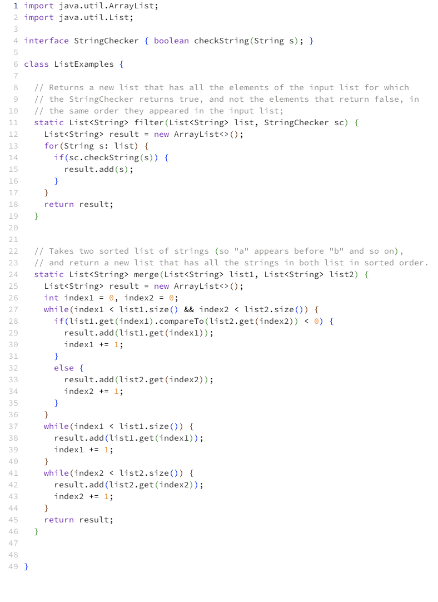

# Lab Report 5 

## Part 1 - Debugging scenario 

Student’s Original Post:
 ### Aneed Halp: 
Hi! I’m having some trouble with implementing the autograder code. 
When I run the bash script with the link `https://github.com/ucsd-cse15l-f22/list-methods-lab3` 
it works and provides a score and no error message. However, when I run it with the corrected methods link, 
`https://github.com/ucsd-cse15l-f22/list-methods-corrected`, it does not work. It prints me a weird message about how 
`expression recursion level exceeded` and doesn’t print out the score correctly either. However, it works for the compile 
errors code too. I think that there is something wrong with my grading code at line 51 as to how I call the variables to 
do subtraction, so I put a `$` in front of the variable names. Am I assigning my variable correctly? Do you know how to 
solve this? 
Thanks!

`<Screenshot>` This is my code at line 51 and the output for the corrected methods when it throws a bug: 

`<Screenshot>` This is my code and the output for the other tests where it works. 

### TA Response 
Hi Aneed! 
Have you tried to print out the values for the `tests` and `failures`? It might be helpful to see what 
values are being stored before they are printed out into the terminal. Additionally, I don’t think that 
you need the `$` before each variable name when assigning a value to `successes` because you have the 
double parentheses already. In bash, arithmetic is done in the form `$(())`, and the inner variables do 
not need another `$` before them.

### Aneed Halp
Thanks for the help! I tried printing out the value of the `tests` and `failures` variables. I added the echo statements, 
but nothing was printed out at first. Then, I tried printing out the `lastline` variable and I realized that the bug is 
that I didn’t take into account the format of the JUnit tests when all of the test cases pass. It says `OK (2 tests)`, 
so it doesn’t get the correct values for the score. The `tests` variable stores the word `tests)` and the failures variable is out of bound for the length of the output, so it stores nothing. That’s why when the final score is printed it says ` / tests)` instead of the actual score.

<Screenshot> These are the values of `tests` and `failures` when all of the test cases pass. We can see that `tests` and `failures` do not contain the correct nuber of tests run and failed respectively.

<Screenshot> These are the values of `tests` and failures when not all test cases pass. In this you can see that the correct number of tests and failures are actually stored in the correct variables. 


### Next steps 
1. The file & directory structure needed to create this bug:
  * 
2. The contents of each file (excluding `.class` files and other files I cannot open) before fixing the bug:
 * `list-examples-grader/grading/ListExamples.java`
    *   
 *  `list-examples-grader/grading/TestListExamples.java`
     *  
 * `list-examples-grader/grading/junit-output.txt`
     * 
 * `list-examples-grader/student/ListExamples.java`
     * 
 * `list-examples-grader/GradeServer.java`
     * 
 * `list-examples-grader/Server.java`
     * 
 * `list-examples-grader/TestListExamples.java`
     * 
 * `list-examples-grader/git-output.txt`
     * 
 * `list-examples-grader/grade.sh`
     * 
 * `list-examples-grader/ta-output.txt`
     * 
   
3. The full command line (or lines) you ran to trigger the bug:
   * bash grade.sh https://github.com/ucsd-cse15l-f22/list-methods-corrected
   
4. A description of what to edit to fix the bug
* In order to fix the bug, I would create an if-else statement in grade.sh in order to account for the case where all test cases pass. I would create a variable to store the first word of the line, and if that word is `OK`, this means that all tests passed in JUnit, so I would print that they received a full score, and this would ensure that this edge case is taken care of before the general format is used for tests where not all of them passed. I would include a code block like the one below before I check the cases for when not all tests pass:
   ```
   checkAllPass=$(echo $endLine | awk '{print $1 }')
   if [[ $checkAllPass == "OK" ]]
   then
      echo "Score: 100%"
      exit 0
   fi
  ```

## Part 2 - Reflection
Something that I learned from my lab experience in the second half of this quarter that I didn't know before was VIM and editing from the terminal. It was very cool because I didn’t know that you could open and edit files in the terminal, and I thought that the terminal was only for running programs or navigating file systems and such, so it was really cool being able to open the java files in vim. Previously, when I was going to make commits in Github, sometimes my terminal would freeze and my keyboard would not be working properly, and I was always very confused because I didn’t know how to escape the mode, but now I realize that I was in vim, and I now know how to navigate using when i’m in the ‘normal’ mode for vim (`:q`). Finally, I enjoyed learning about the shortcuts that vim has, such as the `w` key that allows you to jump forwards to the start of a word, `0` that lets you jump to the start of the line, and how the different keys can be used in conjunction with each other, (i.e. `10 j` that lets you move down 10 lines.)


